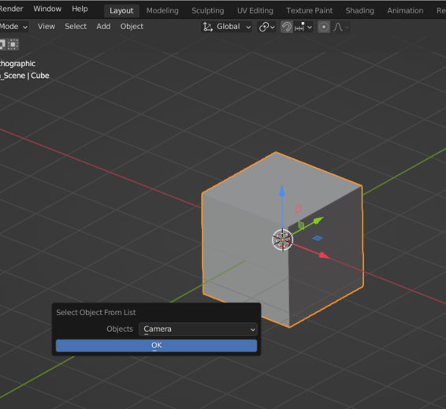

# boqs

**boqs** stands for Blender Object Quick Selection

[boqs logo](./boqs-0.0.1_logo-1024x1024.svg)

## Description

I've created this very simple addon for a need I frequently have: just quickly make an object the active object in the scene,
or "select" it.

So I've made this addon that references all the objects in the scene and presents a popup in which I can select the object I want ot make active,
from a dropdown menu list.

## Installation

Just download this repository, uncompress the archive, then open the preferences in Blender, and in the addons tab use "Install an addon",
go the folder where the `boqs.py` is located then and click install; next activate the addon, and you're done! :)

## Usage

In the viewport, in Object Mode, in the menu bar at the top of the viewport panel, in object, you'll find now a "Selecy an object from list" option,
which will open a popup with a dropdown menu list with the objects of the scene, in that list click the oobject you want to make the active object,
and that's it...

Now you can create a shortcut to easily launch the `boqs` popup; or you can also add it to [quick favorite](https://docs.blender.org/manual/en/4.5/interface/tool_system.html#quick-favorites).

## Contributing

If you'd like to improve that addon, you're welcome! There are several things to implement:

 [ ] List Objects by Collections (and/or by other filters)
 [ ] Write the documentation
 [ ] Generally improve and optimize the code

Please contact me if you're interested to make your skills at use for `boqs`, I would greatly apppreciate it! It's my first Blender addon ever...
